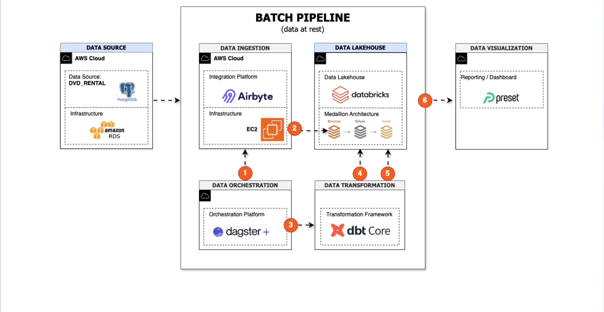
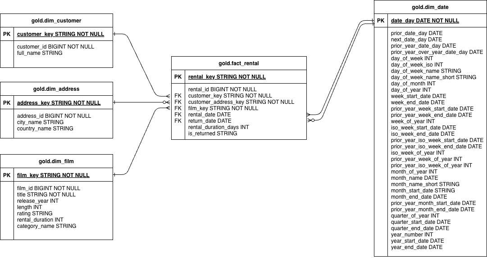
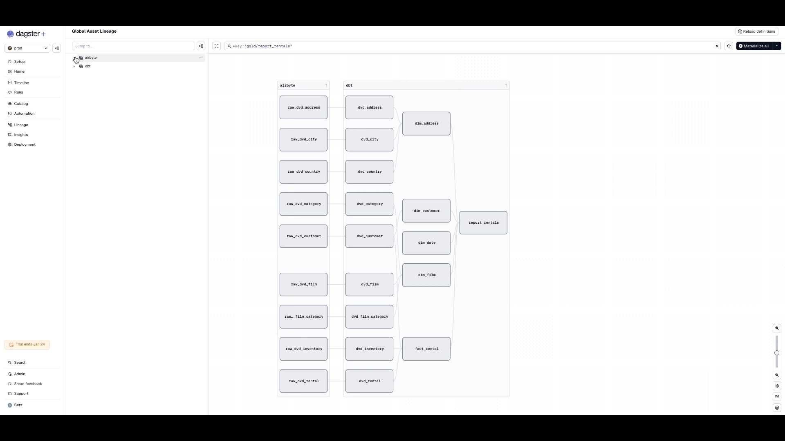
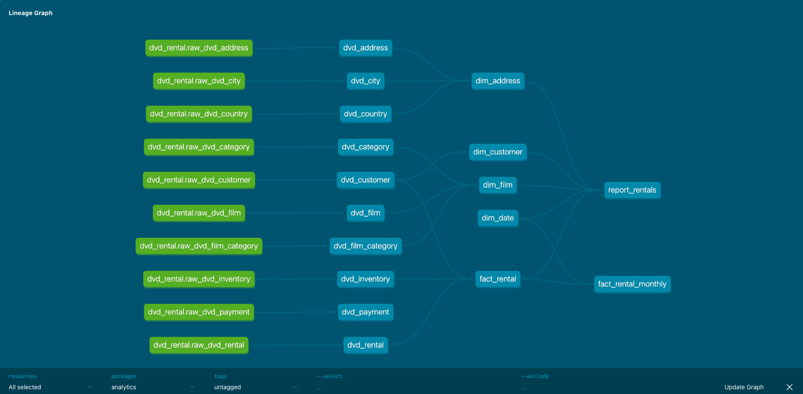

# Batch Data Pipeline

This batch pipeline focuses on analysing **historical rental** and **engagement data** to uncover long-term user behaviour patterns and content performance trends. By processing structured data at scheduled intervals, the pipeline enables reliable, reproducible analytics that support strategic decision-making, reporting, and deeper behavioural analysis.

The batch approach is well-suited for:

Trend analysis over time
- Aggregations and dimensional modelling
- Business intelligence and performance reporting

Specific, batch-oriented business questions addressed by this pipeline are documented within this page.

## Table of Contents<br/>
- [Business Questions](#business-questions)
- [Dashboard](#dashboard)
- [Source Datasets](#source-datasets)
- [Solution Architecture](#solution-architecture)
- [Testing](#testing)
- [Database Structure](#database-structure)
- [ERD for Dimensional Modeling](#erd-for-dimensional-modeling-star-schema)
- [Data Lineage](#data-lineage)
- [Getting Started](#getting-started)
- [Demo](#demo)


---
🔗 **Batch Pipeline Navigation**: 
[Data Source](../../00-data-source/batch/README.md)
| [Data Ingestion](../../01-data-ingestion/batch/README.md)
| [Data Transformation](../../02-data-transformation/batch/README.md)
| [Data Orchestration](../../03-data-orchestration/batch/README.md)
| [Data Consumption](../../04-data-consumption/batch/README.md) 

---

## Business Questions

- Which films have the highest rental volume?
- Which film categories have the highest rental volume?
- What is the rental pattern based on the day of the week?
- Which countries have the highest rental volume?
- Which countries have the longest average rental duration? 


[🔝 Return to TOC](#table-of-contents)

## Dashboard

The batch dashboard presents historical user behaviour and content performance trends, enabling consistent reporting and long-term, strategic analysis. Data comes from the one big table (OBT) serving layer of Databricks. For more details, refer to [page](../../04-data-consumption/batch/README.md).

<div align="center">


</div>

[🔝 Return to TOC](#table-of-contents)


## Source Datasets

| Source name | Source type | Source documentation | Frequency | 
| - | - | - | - |
| DVD Rentals database | PostgreSQL database | https://www.postgresqltutorial.com/postgresql-getting-started/postgresql-sample-database/ | Daily |

[🔝 Return to TOC](#table-of-contents)

## Solution Architecture

The batch architecture processes historical data on a scheduled basis, transforming it into curated analytical models optimised for reliable reporting and trend analysis.

<div align="center">



</div>

**Architecture Flow:**
1. **Dagster+**: triggers **Airbyte** based on a scheduled cron.
2. **Airbyte**: extracts data from a Postgres RDS source **(A)** and performs a incremental append laods into **Databricks Bronze** (raw) tables.
3. **Dagster+**: orchestrates dbt Core transformations and data model builds. Builds Silver “current-state” models (mostly SCD1 dedup) and maintains Customer SCD2 history using dbt snapshots (dvd_customer_scd2) plus a current view (dvd_customer).
4.  **DBT**: performs transformations in **Databricks** from **Bronze → Silver**.
5.  **DBT**: performs transformations in **Databricks** from **Silver → Gold**, producing analytics-ready models. Builds incremental MERGE models for mutable/high-value datasets (e.g. fact_rental, dim_customer).
6.  **Preset dashboards**: query a the **one-big-table (OBT)** generated by the batch pipeline for historical analysis.


[🔝 Return to TOC](#table-of-contents)

## Testing

1. **Source freshness checks**: implemented using dbt source freshness tests to ensure data is up to date.
2. **Row count validation**: performed using dbt expectations to compare record counts between Bronze and Silver layers.
3. **Data quality tests**: applied using dbt tests to validate null constraints, uniqueness, and other column-level rules.

## Database Structure

Implemented bronze → silver → gold data modelling on Databricks database.

| Bronze | Silver | Gold |
| - | - | - | 
| raw_dvd_address (IA) | dvd_address (SCD1 current / dedup) | dim_address |
| raw_dvd_category (IA) | dvd_category (SCD1 current / dedup) |  |
| raw_dvd_city (IA) | dvd_city (SCD1 current / dedup) |  |
| raw_dvd_country (IA) | dvd_country (SCD1 current / dedup) |  |
| raw_dvd_customer (IA) | dvd_customer_scd2 (SCD2 snapshot history)<br>dvd_customer (current view from SCD2) | dim_customer (incremental MERGE on customer_id) |
| raw_dvd_film (IA) | dvd_film (SCD1 current / dedup) | dim_film |
| raw_dvd_film_category (IA) | dvd_film_category (bridge dedup (GROUP BY film_id, category_id)) |  |
| raw_dvd_inventory (IA) | dvd_inventory (SCD1 current / dedup) | |
| raw_dvd_rental (IA) | dvd_rental (SCD1 incremental MERGE on rental_id) | fact_rental (incremental MERGE on rental_id)<br>fact_rental_monthly<br> report_rentals<br>dim_date|
| (count: 10) | (count: 11)| (count: 7) | 

**Notes:**
- **Bronze (IA):** raw incremental append tables (may contain duplicates).
- **Silver:**
  - **SCD1 (Current-State / Dedup):** keep the latest record per primary key.
  - **SCD2 (Customer):**
    - `dvd_customer_scd2`: dbt snapshot history table (`dbt_valid_from`, `dbt_valid_to`)
    - `dvd_customer`: current view (latest version only)
  - **SCD1 Incremental (Rental):**
    - `dvd_rental` is a **mutable transaction** (updated when a film is returned)
    - implemented as **incremental MERGE (upsert)** on `rental_id` to keep the latest current-state record
  - **Bridge table (`dvd_film_category`):**
    - Deduped using `GROUP BY (film_id, category_id)`
- **Gold:**
  - `fact_rental` is implemented as **incremental MERGE (upsert)** on `rental_id` to support updates (e.g. `return_date`) and idempotent reruns.
  - `dim_customer` is implemented as **incremental MERGE (upsert)** on `customer_id` to avoid full refresh over time.

**Additional Notes:**

- **History & Time Travel (Databricks):**
  - **SCD2 (dbt snapshots)** stores *business history* (row-level changes over time) using `dbt_valid_from` / `dbt_valid_to`.
  - **Delta Time Travel** stores *table/version history* (previous states of the entire Delta table) and can be used for debugging, audit, or rollback.
  - Example (Delta Time Travel):
    - `SELECT * FROM silver.dvd_rental VERSION AS OF 5`
- **dbt materializations (Databricks + Delta):**
  - Most Silver “current-state” models are rebuilt using **`CREATE OR REPLACE`** semantics (full refresh).
  - Mutable fact tables (e.g. `dvd_rental`) are maintained using **dbt incremental + MERGE** for idempotent upserts.
  - Customer history is stored using **dbt snapshots (SCD2)** with `dbt_valid_from` / `dbt_valid_to`.
  - Since targets are **Delta tables**, we can also use **Delta Time Travel** to query previous table versions when required (debugging/audit/rollback).
  - Gold facts (e.g. `fact_rental`) can also be maintained using **incremental + MERGE** to avoid full refresh over time.
  - Some Gold dimensions (e.g. `dim_customer`) are maintained using **incremental + MERGE** for scalability.

Breakdown of GOLD tables:

| Type | Count | Frequency | Table Name | 
| - | - | - | - | 
| Dimension Table | 4 | Daily | dim_address, dim_customer, dim_film, dim_date  |
| Fact Table | 1 | Daily | fact_rental | 
| Fact Table | 1 | Monthly Snapshot | fact_rental_monthly | 
| One Big Table | 1 | Daily | report_rentals |

<br/>


[🔝 Return to TOC](#table-of-contents)

## ERD for Dimensional Modeling (Star Schema)

<div align="center">



</div>

[🔝 Return to TOC](#table-of-contents)

## Data Lineage 

Data lineage is visualised in Dagster, showing the end-to-end flow from Airbyte ingestion through dbt transformations, alongside dbt’s native lineage graph for model-level dependencies across Bronze, Silver, and Gold layers.

<div align="center">




</div>

[🔝 Return to TOC](#table-of-contents)

## Getting Started


### Prerequisites

-  Python 3.13+ (for local development)
-  Conda (recommended for environment management)
- Access to:
  -  AWS RDS (PostgreSQL) for batch source data
  -  Databricks workspace
  -  Dagster+ (or local Dagster)
  -  Airbyte (for data ingestion)
  -  Preset (for dashboards)

### Quick Setup

1. **Set up batch data source:**
   - Follow instructions in [Batch Data Source](../../00-data-source/batch/README.md) to restore the DVD rental database

2. **Install Python dependencies:**
   ```bash
   pip install -r requirements.txt
   ```

3. **Configure components:**
   - **Airbyte:** Set up connection from PostgreSQL to Databricks ([Airbyte Setup](../../01-data-ingestion/batch/README.md))
   - **dbt:** Configure dbt project and profiles ([dbt Setup](../../02-data-transformation/batch/README.md))
   - **Dagster+:** Deploy and configure orchestration ([Dagster Setup](../../03-data-orchestration/batch/README.md))
   - **Preset:** Import dashboard configuration ([Preset Setup](../../04-data-consumption/batch/README.md))

4. **Run the pipeline:**
   - The pipeline runs automatically on a daily schedule via Dagster+ (when you enable the automation)
   - You can also trigger manual runs through the Dagster+ UI

For detailed setup instructions for each component, refer to the [Installation Instructions](#installation-instructions) section below.

[🔝 Return to TOC](#table-of-contents)

## Demo

<div align="center">


</div>

---
🔗 **Page Navigation**:  
[Main](../../README.md) 
| Batch 
| [Streaming](../streaming/README.md) 
| [Prev](../../README.md) 
| [Next](../../00-data-source/batch/README.md)

🔗 **Batch Pipeline Navigation**: 
[Data Source](../../00-data-source/batch/README.md)
| [Data Ingestion](../../01-data-ingestion/batch/README.md)
| [Data Transformation](../../02-data-transformation/batch/README.md)
| [Data Orchestration](../../03-data-orchestration/batch/README.md)
| [Data Consumption](../../04-data-consumption/batch/README.md) 
