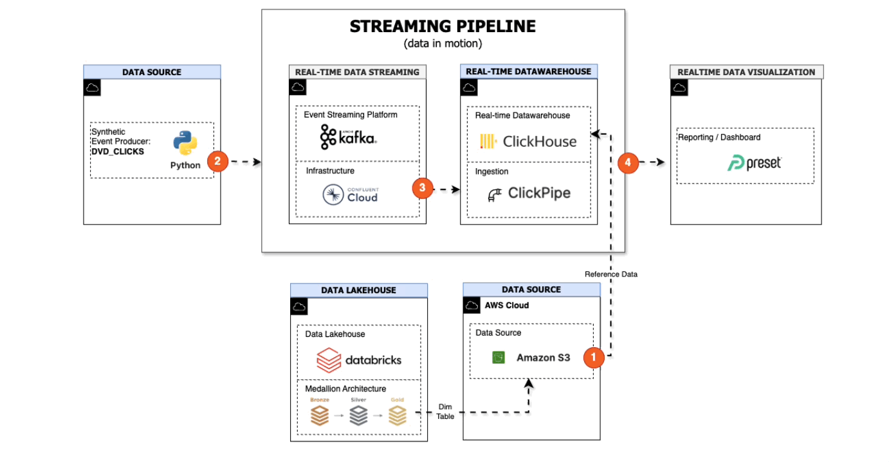

# Streaming Data Pipeline

## Overview

This streaming pipeline focuses on processing real-time clickstream events to capture current user activity and emerging content trends as they happen. By ingesting and transforming event data with low latency, the pipeline enables timely, operational insights that complement historical analysis.

The streaming approach is designed for:

- Monitoring live user behaviour
- Detecting trending content in near real time
- Supporting responsive, data-driven actions

Specific, streaming-oriented business questions addressed by this pipeline are documented within this page.

## Table of Contents<br/>
- [Business Questions](#business-questions)
- [Dashboard](#dashboard)
- [Source Datasets](#source-datasets)
- [Solution Architecture](#solution-architecture)
- [Data Lineage](#data-lineage)
- [Getting Started](#getting-started)
- [Demo](#demo)


---
🔗 **Streaming Pipeline Navigation**: 
[Data Source](../../00-data-source/streaming/README.md)
| [Data Ingestion](../../01-data-ingestion/streaming/README.md)
| [Data Transformation](../../02-data-transformation/streaming/README.md)
| [Data Consumption](../../04-data-consumption/streaming/README.md) 

---


## Business Questions

- What films are trending right now?
- Which films have the highest rental volume?
- Which film categories have the highest rental volume?
- How many active users are using the online platform?
- How does user activity evolve over time?
- How do device types and interaction patterns differ among users?

[🔝 Return to TOC](#table-of-contents)

## Dashboard

The streaming dashboard provides near real-time visibility into user activity and emerging content trends, supporting timely, operational insights. Data comes from the serving layer of Clickhouse.

<div align="center">


</div>

[🔝 Return to TOC](#table-of-contents)


## Source Datasets

| Source name | Source type | Source documentation | Frequency | 
| - | - | - | - |
| DVD Clicks (Synthetic) | Kafka Streaming Producer | [Synthetic Data](../../00-data-source/streaming/README.md#clickstream-dataset) | Real-time | 

[🔝 Return to TOC](#table-of-contents)

## Solution Architecture

The streaming architecture processes real-time event data with low latency, enabling near real-time analytics and timely insight generation.

<div align="center">



</div>

**Architecture Flow:**
1. **Reference data**: (dim_film) is exported from Databricks via an external S3 location and ingested into ClickHouse as a lookup table.
2. **Python Kafka producer (Confluent client)**: publishes DVD clickstream events to a Kafka topic.
3. **ClickHouse ClickPipes**: ingests streaming events from Kafka into raw event tables.
4. **Materialized views** updated that aggregate and transform streaming data for analytical use.
5. **Preset dashboards**: query ClickHouse tables and materialized views to display near real-time insights.


[🔝 Return to TOC](#table-of-contents)


## Data Lineage 

Streaming data lineage follows events from the Kafka producer, through the Kafka topic, into ClickHouse via ClickPipes, with downstream tables and materialized views forming the analytical lineage.

<div align="center">


</div>

[🔝 Return to TOC](#table-of-contents)


## Getting Started

### Prerequisites

- Python 3.13+ (for local development)
- Conda (recommended for environment management)
- Access to:
  - Confluent Cloud (Kafka)
  - ClickHouse Cloud
  - AWS S3 (for reference data)
  - Preset (for dashboards)

### Quick Setup

1. **Set up streaming data source:**
   - Follow instructions in [Streaming Data Source](../../00-data-source/streaming/README.md) to configure Kafka topic and producer

2. **Install Python dependencies:**
   ```bash
   pip install -r requirements.txt
   ```

3. **Configure components:**
   - **Kafka Topic:** Set up topic in Confluent Cloud ([Kafka Setup](../../00-data-source/streaming/README.md))
   - **ClickPipes:** Configure ClickPipes to ingest from Kafka ([ClickPipes Setup](../../01-data-ingestion/streaming/README.md))
   - **ClickHouse Transformations:** Create materialized views ([ClickHouse Transformations](../../02-data-transformation/streaming/README.md))
   - **Preset:** Import dashboard configuration ([Preset Setup](../../04-data-consumption/streaming/README.md))

4. **Run the producer:**
   ```bash
   cd 00-data-source/streaming/02-kafka-producer
   python dvd_clicks_cloud_producer.py
   ```

5. **Monitor the pipeline:**
   - Events flow from Kafka → ClickPipes → ClickHouse tables → Materialized views
   - Dashboard updates in real-time as new events arrive


[🔝 Return to TOC](#table-of-contents)

## Demo

The streaming pipeline continuously ingests click events from Kafka and updates materialized views in real-time. The dashboard reflects these updates as new events arrive, showing trending films and user activity patterns.

[🔝 Return to TOC](#table-of-contents)

---
🔗 **Page Navigation**:  [Main](../../README.md) | [Batch](../batch/README.md) | Streaming | [Prev](../../04-data-consumption/batch/README.md) | [Next](../../00-data-source/streaming/README.md)

🔗 **Streaming Pipeline Navigation**: 
[Data Source](../../00-data-source/streaming/README.md)
| [Data Ingestion](../../01-data-ingestion/streaming/README.md)
| [Data Transformation](../../02-data-transformation/streaming/README.md)
| [Data Consumption](../../04-data-consumption/streaming/README.md) 


