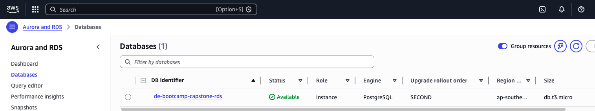

# Batch Data Source

This section covers setting up the Postgres database for the DVD rentals batch data. The `dvd_rental` database is used to ingest dvd rental data from the Postgres to Databricks via Airbyte.

## Steps for Batch data: dvd_rental

Follow the steps below to install the DVD Rentals database in your Postgresql instance.

1. Unzip the `dvdrental.zip` file in the database directory
2. Select an existing server or create a new server
3. Create a new database within your server, give it any name you wish e.g. `dvd_rental`
4. Select the database
5. Select `Tools` > `Restore`
6. Configure Restore:
   - Change `Format` to "Directory"
   - Change `Filename` to the dvdrental directory that was created when you performed the unzip e.g. `dvd_rental`
7. Select `Restore`. You should see a success message.

Below screenshot shows RDS instance was created to host the source data.

---
🔗 **Page Navigation**:  [Main](../../README.md) | [Batch](../../batch/00-data-pipelines/batch/README.md) | [Streaming](../../streaming/00-data-pipelines/batch/README.md) | [Prev](../../00-data-pipelines/batch/README.md) | [Next](../../01-data-ingestion/batch/README.md)
