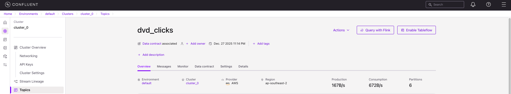
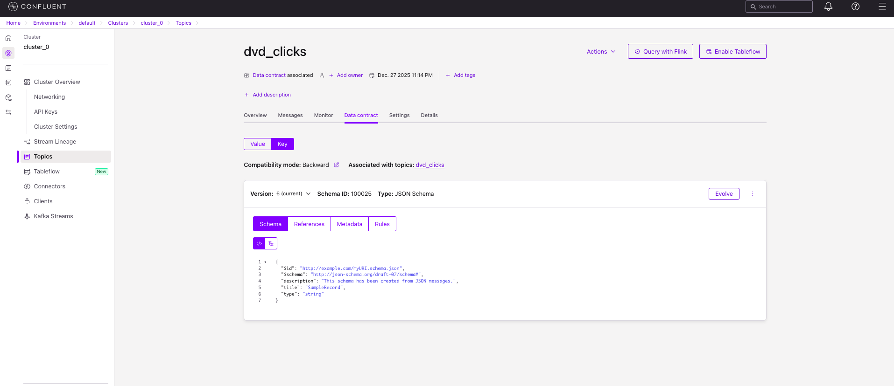
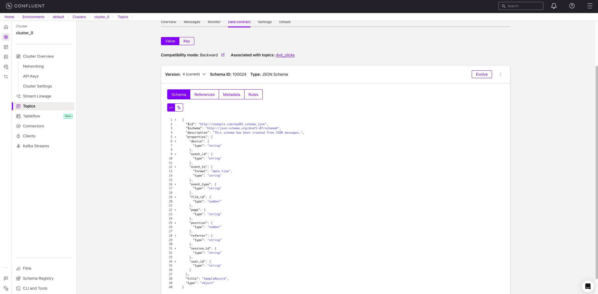
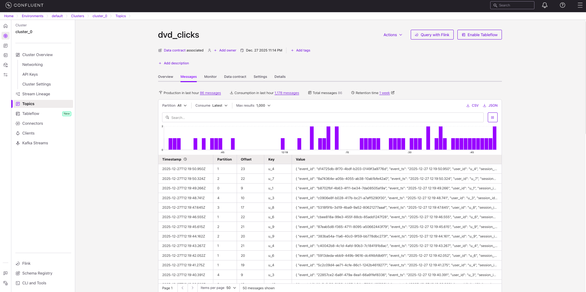
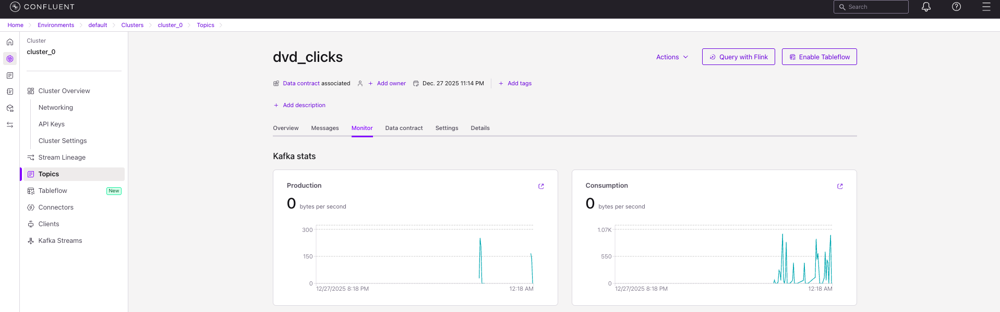
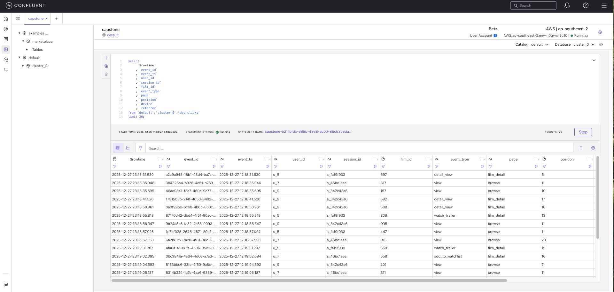

# Streaming Data Source

This section covers setting up the Kafka topic in Confluent Cloud for the DVD clicks streaming data. The `dvd_clicks` topic is used to stream real-time click events from the Kafka producer to ClickHouse via ClickPipes.


## Topic Configuration

1. Create a new topic in Confluent Cloud
2. Name the topic: `dvd_clicks`
3. Configure appropriate partitions and replication settings based on your throughput requirements.

<div align="center">


  
</div>


## Data Contract

The topic uses a structured data contract for both key and value schemas. 

### Key Schema

The message key identifies the user:

<div align="center">



</div>

### Value Schema

The message value contains the click event details:

<div align="center">



</div>

Schema definitions are available in :
- `./01-kafka-topic/json/data-contract-dvd_clicks-key-v6.json`
- `./01-kafka-topic/json/data-contract-dvd_clicks-value-v4.json`
- `./01-kafka-topic/json/schema-dvd_clicks-key-v6.json`
- `./01-kafka-topic/json/schema-dvd_clicks-value-v4.json`


## Run Customised Kafka Producer

Pre-requisite/s:
Ensure that you have already setup the following in Confluent:
1. Environment and kafka cluster
2. Topic: `dvd_clicks` 
3. Python Client
4. Installed `confluent-kafka>=2.3.0`

Running the Python Client Producer:
From repo root, ensure you are in directory: `cd 00-data-source/streaming/02-kafka-producer`
1. Create `client.properties` based from `client.properties.template` and update.
2. Run the Python producer file: `python dvd_clicks_cloud_producer.py`

<div align="center">



</div>

## Verification

Monitor the topic to verify events are being produced:

<div align="center">



</div>

1. Navigate to the topic in Confluent Cloud
2. Select the "Messages" tab
3. Verify events are arriving in real-time
4. Go to `Flink` and open a workspace.
3. Copy the SQL from `00-data-source/streaming/03-flink-sql/sample.sql`
4. Click `Run`.

<div align="center">



</div>

5. Click `Stop` after verifying.


# Clickstream Dataset

## Overview

The DVD Clickstream dataset is a fake data that represents real-time user interactions with a DVD browsing platform. It is designed as a streaming event dataset, optimised for real-time analytics, trending insights, and simple recommendation use cases.

## Event Semantics

Each record represents a single user interaction with a film, such as viewing, opening details, or adding to a watchlist.

- User: long-lived logical identity
- Session: short-lived burst of activity (rotates on inactivity)
- Event: atomic, append-only interaction

Multiple events occur per session, and users may have multiple sessions over time.

## Schema Definition

dvd_clicks event schema:

| Column       | Type (Logical)     | Description                                      |
| ------------ | ------------------ | ------------------------------------------------ |
| `event_id`   | String               | Unique identifier for the event (UUID)                 |
| `event_ts`   | DateTime           | Time when the interaction occurred (event time in UTC timestamp)  |
| `user_id`    | String             | User identifier                           |
| `session_id` | String             | Groups events within a browsing session          |
| `film_id`    | Integer            | Identifier of the film                 |
| `event_type` | String             | Type of interaction (e.g. `view`, `detail_view`) |
| `page`       | String             | Page or context where the interaction occurred   |
| `position`   | Integer            | Rank of the film in a list at click time         |
| `device`     | String             | Device category (web, mobile, tablet)            |
| `referrer`   | String             | Entry source (homepage, search, recommendation)  |


details of event type column:

| Event Type         | Meaning                             |
| ------------------ | ----------------------------------- |
| `view`             | Film appeared in a browsing context |
| `detail_view`      | User opened the film detail page    |
| `watch_trailer`    | User interacted with the trailer    |
| `add_to_watchlist` | User saved film for later           |

## Example Event

#### Key:
```
"u_10"
```
#### Message:
```
{
  "event_id": "84e0e977-9ee7-4eec-9cd6-f7655e481cb3",
  "event_ts": "2025-12-27 12:18:51.766",
  "user_id": "u_10",
  "session_id": "s_53482d2c",
  "film_id": 331,
  "event_type": "view",
  "page": "browse",
  "position": 9,
  "device": "tablet",
  "referrer": "recommendation"
}
```

---
🔗 **Page Navigation**:  [Main](../../README.md) | [Batch](../../batch/00-data-pipelines/batch/README.md) | [Streaming](../../streaming/00-data-pipelines/batch/README.md) | [Prev](../../00-data-pipelines/streaming/README.md) | [Next](../../01-data-ingestion/streaming/README.md)