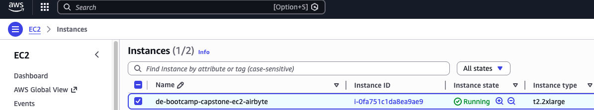
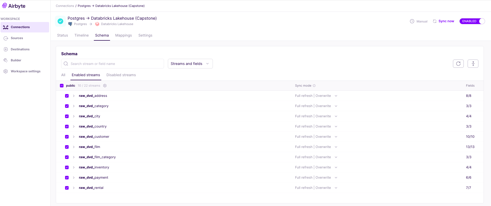
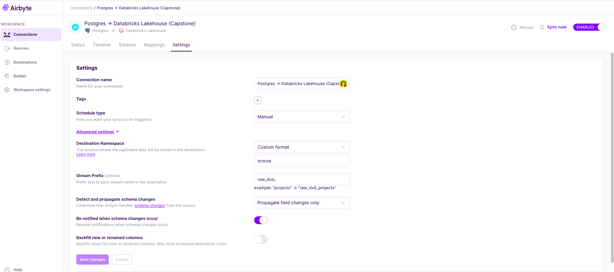
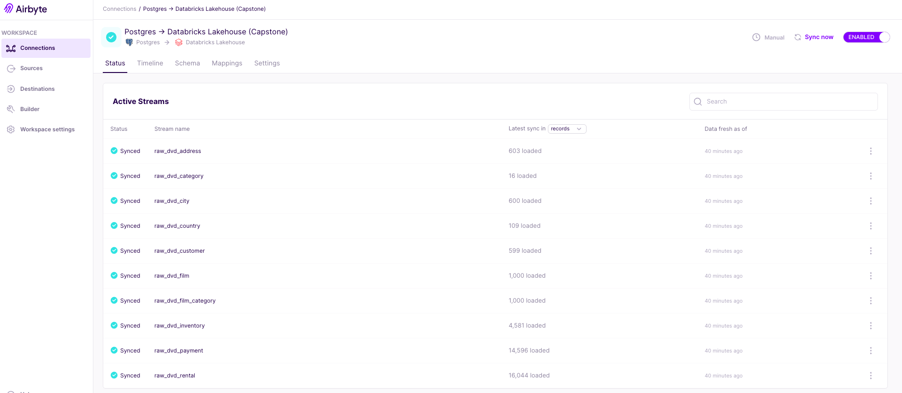

# Batch Data Ingestion

This section covers setting up Airbyte to sync data from PostgreSQL (dvd_rental) to Databricks.

## Prerequisites

Airbyte is hosted on AWS EC2 for this project. Ensure you have access to:
- Airbyte instance (hosted on AWS EC2)
- PostgreSQL database (dvd_rental)
- Databricks workspace with Unity Catalog

<div align="center">



</div>

## Sync data from dvd_rental to Databricks

### Create source (dvd_rental)

1. Go to sources and select "+ New source"
2. For "Source type", select "Postgres":
    - Name: `dvd_rental`
    - Host: input_host
    - Port: `5432`
    - Database name: `dvd_rental`
    - Schemas: `public`
    - Username: `postgres`
    - Password: input_password

3. Advanced:
    - Update method: Select "Scan Changes with User Defined Cursor"
4. Select "Set up source"

### Create destination (databricks)

For the Databricks connection, you'll need to grab the following variables using these steps:

```
host: your_host_name
http_path: your_http_path
token: your_access_token
```
**Pre-requisites:**
1. Go to "SQL Warehouses" and select your starter warehouse 
2. Copy the server host name and HTTP path
3. To generate your access token, select "Developer" and then "Manage" your access tokens to Generate a new token 

**Setup destination:**
1. Go to destinations and select "+ New destination"
2. For "Source type" select "Databricks Lakehouse"
    - Name: Databricks
    - Server Hostname: your server hostname
    - HTTP Path: your HTTP path
    - Databricks Unity Catalog Name: workspace
    - Authentication: Personal access token
    - personal_access_token: your access token
3. Select "Set up destination"

### Create connection

1. Go to Connections and select "+ New connection"
2. For Select an existing source, select "dvd_rental" and "Use existing source"
3. For Select an existing destination, select "databricks" and "Use existing destination"
4. For the new connection:
   - Connection name: `<leave_as_default>`
   - Replicate source
   - Select your streams
   - Set the sync mode for target tables to: `Full refresh | Overwrite`
5. Select "Set up connection"
6. Trigger a manual sync
7. Verify that datasets have been synced in Databricks

<div align="center">


--

--

--


</div>

---
🔗 **Page Navigation**: 
[Main](../../README.md) 
| [Batch](../../00-data-pipelines/batch/README.md) 
| [Streaming](../../00-data-pipelines/streaming/README.md) 
| [Prev](../../00-data-source/batch/README.md) 
| [Next](../../02-data-transformation/batch/README.md)

🔗 **Batch Pipeline Navigation**: 
[Data Source](../../00-data-source/batch/README.md)
| Data Ingestion
| [Data Transformation](../../02-data-transformation/batch/README.md)
| [Data Orchestration](../../03-data-orchestration/batch/README.md)
| [Data Consumption](../../04-data-consumption/batch/README.md) 