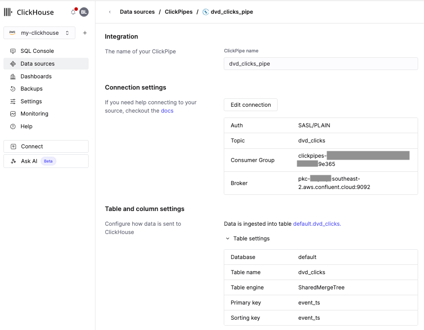
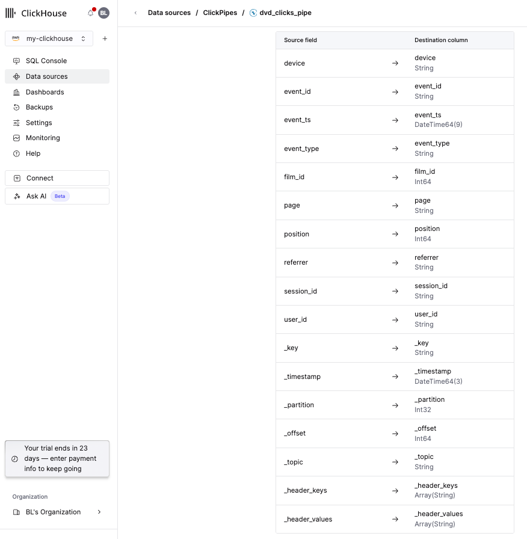
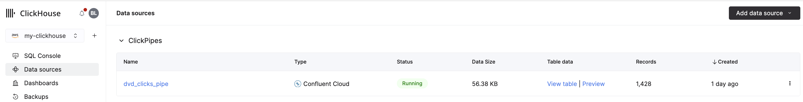
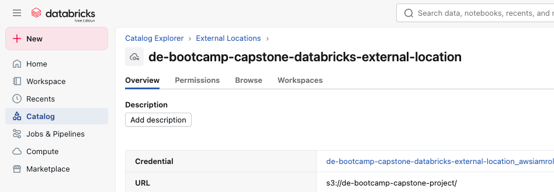
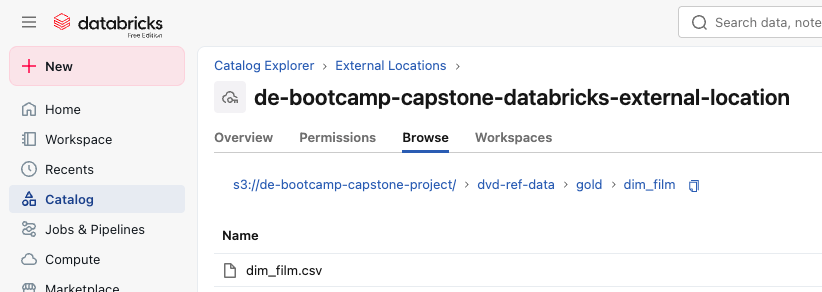
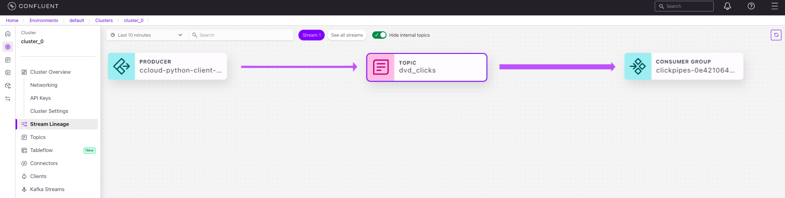

# Streaming Data Ingestion

ClickPipes is ClickHouse Cloud's native connector for ingesting data from Kafka topics. It automatically creates tables and continuously streams data from Kafka into ClickHouse.


## Data Flow

1. Kafka producer sends `dvd_clicks` events to Confluent Cloud topic
2. ClickPipe automatically ingests events from Kafka topic
3. Data is stored in `dvd_clicks` table in ClickHouse
4. Reference data `ref_dim_film` is loaded from S3 for enrichment


## Prerequisites

1. ClickHouse Cloud account and cluster
2. Confluent Cloud environment with Kafka cluster
3. Kafka topic `dvd_clicks` already created.
4. Reference data file (`dim_film`) available in S3.


## Setup Instructions

### 1. Create ClickPipe Connection

1. In ClickHouse Cloud, navigate to **Data Ingestion** > **ClickPipes**
2. Click **Create ClickPipe**
3. Configure the connection:
   - **Name**: `dvd_clicks_pipe`
   - **Source**: Select your Kafka cluster (Confluent Cloud)
   - **Topic**: `dvd_clicks`
   - **Format**: JSON
4. ClickHouse will automatically create the `dvd_clicks` table based on the Kafka topic schema
5. Start the ClickPipe to begin ingesting data

<div align="center">


--


--



</div>

### 2. Reference Data Setup

The reference dimension table `ref_dim_film` needs to be loaded from S3:

1. Export `dim_film` from Databricks to S3:
   ```python
   df = spark.table("analytics.gold.dim_film")
   df.write \
     .mode("overwrite") \
     .option("header", "true") \
     .csv("<input_path>")
   ```

<div align="center">





</div>

2. Generate a pre-signed URL for the CSV file in S3 (workaround)

3. Execute the SQL script to create and load the reference table:

### Create dvd_clicks Table

The table is automatically created by ClickPipe, but the schema is defined in:
- `./clickpipes-clickhouse/sql/create_dvd_clicks.sql`

### Create Reference Dimension Table

Load the reference film dimension from S3:
- `./clickpipes-clickhouse/sql/create_ref_dim_film.sql`

## Verification

1. Check ClickPipe status in ClickHouse Cloud dashboard
2. Verify data is being ingested:
   ```sql
   SELECT COUNT(*) FROM dvd_clicks;
   SELECT * FROM dvd_clicks LIMIT 10;
   ```
3. Verify reference data is loaded:
   ```sql
   SELECT COUNT(*) FROM ref_dim_film;
   ```
4. Check data lineage in ClickHouse to see the flow from Kafka topic to table

<div align="center">



</div>

---
🔗 **Page Navigation**: 
[Main](../../README.md) 
| [Batch](../../00-data-pipelines/batch/README.md) 
| [Streaming](../../00-data-pipelines/streaming/README.md) 
| [Prev](../../00-data-source/streaming/README.md) 
| [Next](../../02-data-transformation/streaming/README.md)

🔗 **Streaming Pipeline Navigation**: 
[Data Source](../../00-data-source/streaming/README.md)
| Data Ingestion
| [Data Transformation](../../02-data-transformation/streaming/README.md)
| [Data Consumption](../../04-data-consumption/streaming/README.md) 