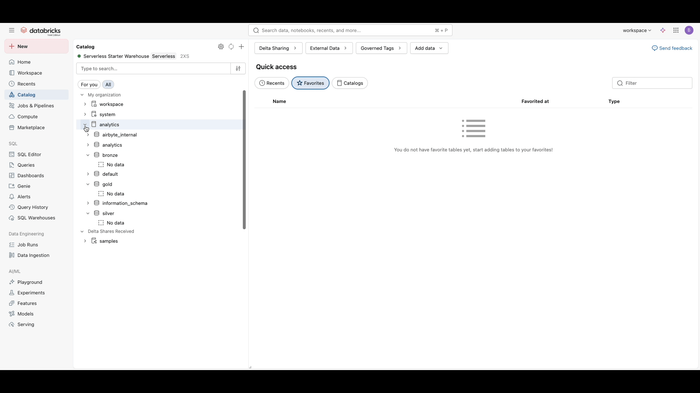

# Batch Data Transformation

The batch transformation layer uses dbt (data build tool) to transform raw data from the bronze layer into silver and gold layers following a medallion architecture.

# DBT Project

Following are instructions when running DBT locally.

## Installation instructions

1. Update dbt `profiles.yml`:
```
host: <your_host_name>
http_path: <your_http_path>
```

2. Set DATABRICKS_TOKEN in current session:
```
export DATABRICKS_TOKEN=<your_token>
```

3. Install dbt packages: (dbt_utils, dbt_date)
Ensure you are in the folder:  `02-data-transformation/batch/dbt/analytics`
```
dbt deps
```

4. Verify DBT connection to databricks:
```
dbt debug
```

## Running Instructions

1. Materialize new model/s using commands:
```
dbt run
dbt run --select <model_name>
dbt test (test only)
dbt build (run and test)
dbt deps && dbt run && dbt test
dbt source freshness
```

2. Generate Lineage
```
dbt docs generate
dbt docs serve
```

Go to http://localhost:8080/ to view the documentation user interface

3. Verify tables created in Databricks

After running `dbt run`, you can verify that tables have been created in Databricks:

<div align="center">



</div>

---
🔗 **Page Navigation**: 
[Main](../../README.md) 
| [Batch](../../00-data-pipelines/batch/README.md) 
| [Streaming](../../00-data-pipelines/streaming/README.md) 
| [Prev](../../01-data-ingestion/batch/README.md) 
| [Next](../../03-data-orchestration/batch/README.md)

🔗 **Batch Pipeline Navigation**: 
[Data Source](../../00-data-source/batch/README.md)
| [Data Ingestion](../../01-data-ingestion/batch/README.md)
| Data Transformation
| [Data Orchestration](../../03-data-orchestration/batch/README.md)
| [Data Consumption](../../04-data-consumption/batch/README.md) 