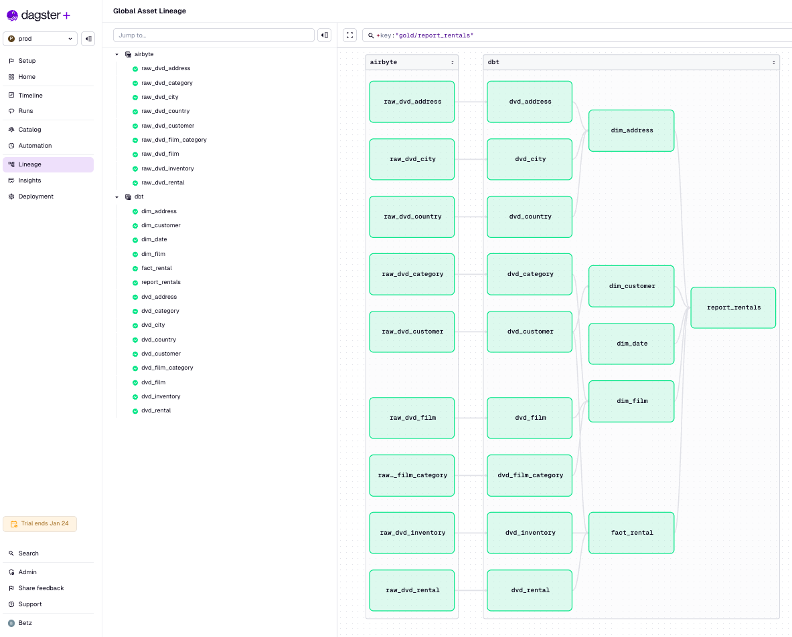
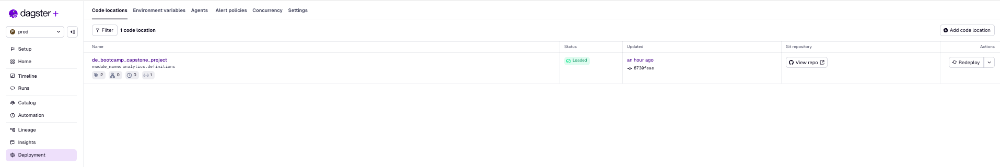
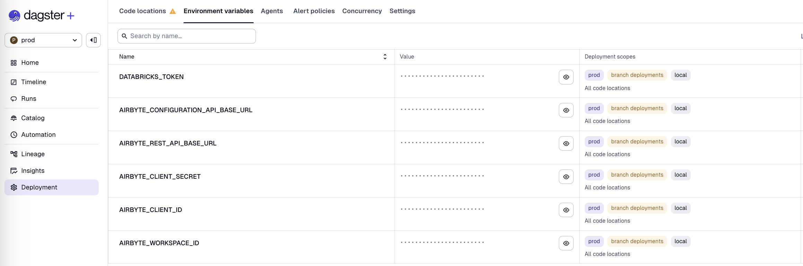
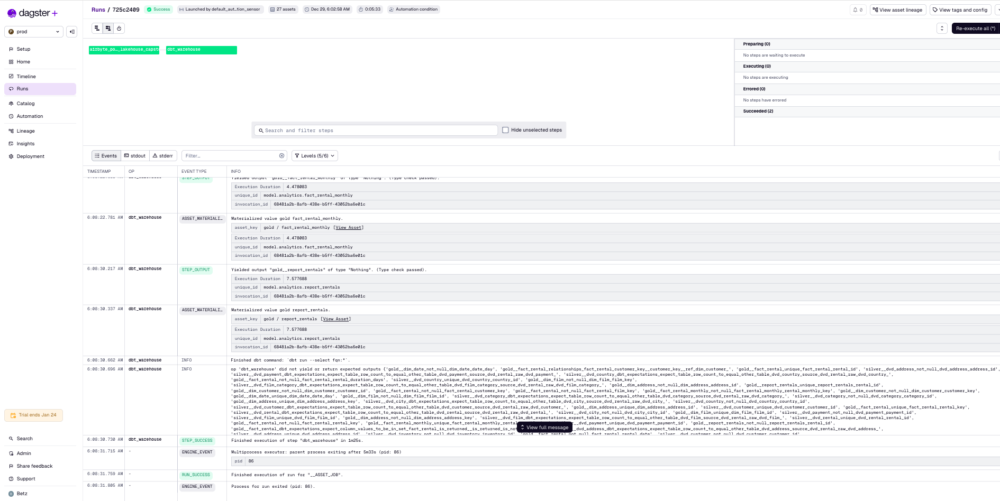

# Batch Data Orchestration

This project uses [Dagster](https://dagster.io/) for orchestrating the batch data pipeline, coordinating Airbyte data ingestion and dbt transformations.

## Overview

Dagster orchestrates the batch pipeline by:
1. Triggering Airbyte connections on a daily schedule
2. Triggering dbt transformations after successful data ingestion
3. Managing dependencies between data assets
4. Providing lineage visualization and monitoring

<div align="center">



</div>

## Getting Started

### Local Development

First, install your Dagster code location as a Python package. 

```bash
cd 03-data-orchestration/batch/dagster
pip install -e ".[dev]"
```

Then, start the Dagster UI web server:

```bash
dagster dev
```

Open http://localhost:3000 with your browser to see the project.

## Deployment

The project is deployed on Dagster+ (Dagster Cloud) for production orchestration.

<div align="center">



</div>

## Environment Variables

<div align="center">



</div>


## Runs

<div align="center">



</div>

---
🔗 **Page Navigation**: 
[Main](../../README.md) 
| [Batch](../../00-data-pipelines/batch/README.md) 
| [Streaming](../../00-data-pipelines/streaming/README.md) 
| [Prev](../../02-data-transformation/batch/README.md) 
| [Next](../../04-data-consumption/batch/README.md)

🔗 **Batch Pipeline Navigation**: 
[Data Source](../../00-data-source/batch/README.md)
| [Data Ingestion](../../01-data-ingestion/batch/README.md)
| [Data Transformation](../../02-data-transformation/batch/README.md)
| Data Orchestration
| [Data Consumption](../../04-data-consumption/batch/README.md) 