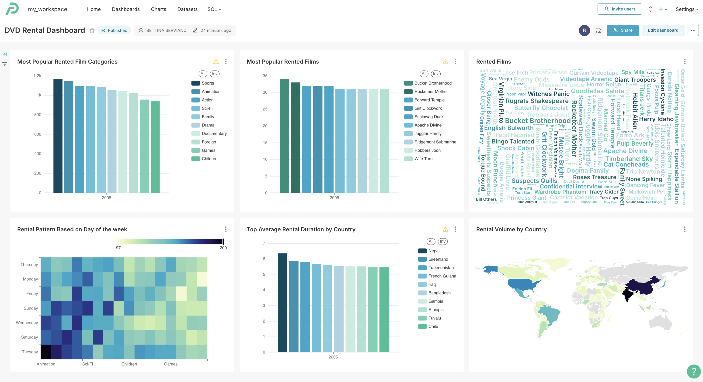

# Batch Data Visualisation

The batch dashboard provides historical analytics and insights from the DVD rental database, including:
- Rental volumes by country, film, and category
- Average rental duration by country
- Rental patterns by day of the week

## Dashboard Components

The dashboard visualizes data from the `report_rentals` one-big-table in the Gold layer, which combines:
- Fact rental data
- Customer dimensions
- Film dimensions
- Address/country dimensions
- Date dimensions

## Installation Instructions

1. Under 04-data-consumption/batch folder, (update the databases yaml file, if needed) compress the `preset` folder to create the `preset_batch.zip` file.
2. Login in Preset.
3. Load a workspace (and create database connection, if needed).
4. Navigate the `Dashboards` page.
5. Click on the `Import` icon found at the upper right hand side of the page (below settings).
6. Click on the `Select file`, then click on the `preset_batch.zip` file.
7. Click `import`.
8. It may prompt you for the Database password, `enter the Databricks token`.
9. Click on `DVD Rental Dashboard`.

---
🔗 **Page Navigation**: [Main](../../README.md) 
| [Batch](../../00-data-pipelines/batch/README.md) 
| [Streaming](../../00-data-pipelines/streaming/README.md) 
| [Prev](../../03-data-orchestration/batch/README.md) 
| [Next](../../00-data-pipelines/streaming/README.md)

🔗 **Batch Pipeline Navigation**: 
[Data Source](../../00-data-source/batch/README.md)
| [Data Ingestion](../../01-data-ingestion/batch/README.md)
| [Data Transformation](../../02-data-transformation/batch/README.md)
| [Data Orchestration](../../03-data-orchestration/batch/README.md)
| Data Consumption