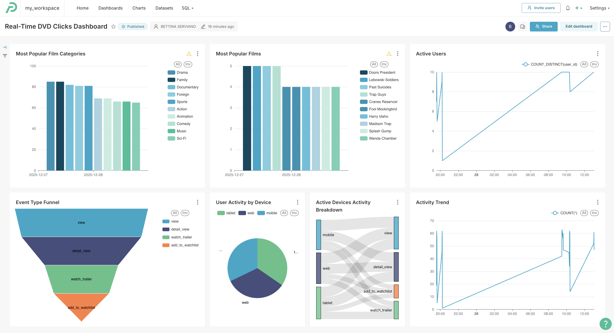

# Streaming Data Visualisation

The streaming dashboard provides real-time insights from DVD click events, including:
- Active users and their activity patterns
- Trending films and categories
- Clicks per minute aggregations
- Event type funnels
- Device type breakdowns

## Dashboard Components

The dashboard visualizes data from:
- `dvd_clicks` table - raw click events
- `mv_clicks_per_min_by_category_and_film` - materialized view with 1-minute aggregations
- `ref_dim_film` - reference dimension for film details

**Charts included:**
- Active Users
- Clicks per minute
- Most Popular Films
- Event Type Funnel
- Active Devices Activity Breakdown
- Most Popular Film Categories
- User Activity by Device

## Installation

1. Under 04-data-consumption/streaming folder, (update the databases yaml file, if needed) compress the `preset` folder to create the `preset_streaming.zip` file.
2. Login in Preset.
3. Load a workspace (and create database connection, if needed).
4. Navigate the `Dashboards` page.
5. Click on the `Import` icon found at the upper right hand side of the page (below settings).
6. Click on the `Select file`, then click on the `preset_streaming.zip` file.
7. Click `import`.
8. It may prompt you for the Database password, `enter the CLickhouse token`.
9. Click on `Real-Time DVD Clicks Dashboard`.

---
🔗 **Page Navigation**: 
[Main](../../README.md) 
| [Batch](../../batch/00-data-pipelines/batch/README.md) 
| [Streaming](../../streaming/00-data-pipelines/batch/README.md) 
| [Prev](../../02-data-transformation/streaming/README.md) 
| Next

🔗 **Streaming Pipeline Navigation**: 
[Data Source](../../00-data-source/streaming/README.md)
| [Data Ingestion](../../01-data-ingestion/streaming/README.md)
| [Data Transformation](../../02-data-transformation/streaming/README.md)
| Data Consumption