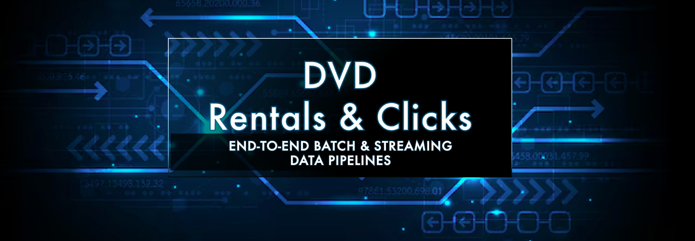
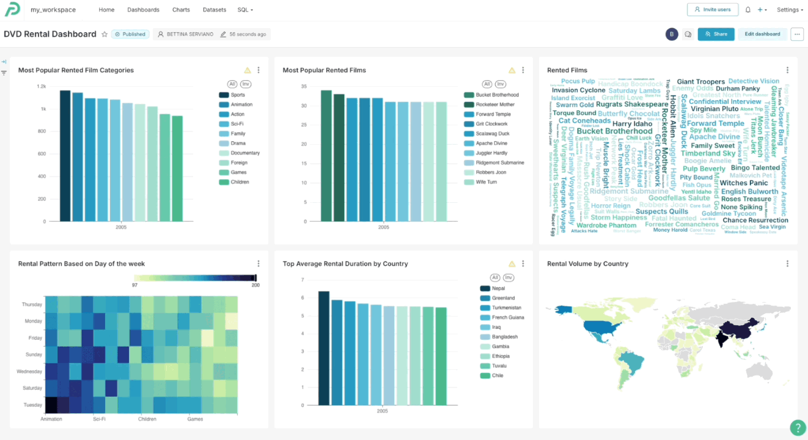
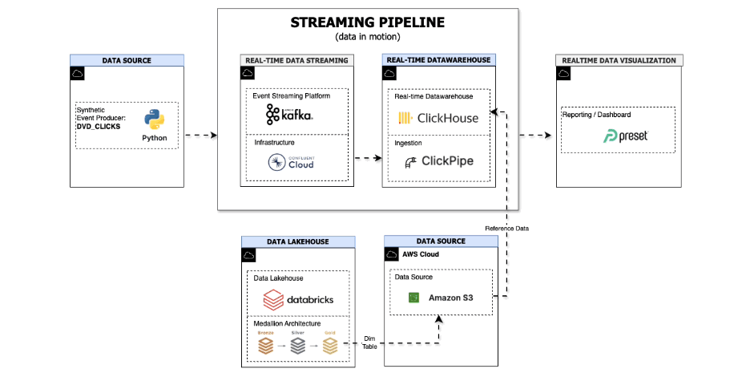

## Data Engineering Capstone Project: Batch and Streaming Pipelines

<div align="center">



</div>

## Table of Contents<br/>
- [Business Context](#business-context)
- [Objective](#objective)
- [Consumers](#consumers)
- [Business Questions](#business-questions)
- [Dashboards](#dashboards)
- [Source Datasets](#source-datasets)
- [Solution Architecture](#solution-architecture)
- [Tech Stack](#tech-stack)
- [Repository Structure and Navigation](#respository-structure-and-navigation)
- [Demo](#demo)
- [Lessons learned](#lessons-learned)
- [Technical Debt and Improvement Opportunities](#technical-debt-and-improvement-opportunities)

## Business Context

The DVD rental business operates globally, with physical stores across multiple regions and an online platform where users browse catalogues, discover content, and add rentals to their baskets.

Customer interactions span both in-store transactions and online activity, creating a need for visibility into **long-term rental behaviour** as well as **real-time user engagement**. Together, these insights help the business better understand demand patterns, emerging trends, and opportunities for growth.

[🔝 Return to TOC](#table-of-contents)

## Objective

This project demonstrates an end-to-end batch and streaming data pipelines designed to answer key business questions for a DVD rental business.

It combines **batch analytics** (historical rentals, catalogue performance) with **real-time streaming analytics** (user clicks, activity trends), orchestrated and transformed using modern data-engineering platforms.

[🔝 Return to TOC](#table-of-contents)

## Consumers

The primary consumers of this data platform are **data analysts** and **business operations teams**, who rely on both historical insights and real-time events to support reporting, monitoring, and decision-making.

[🔝 Return to TOC](#table-of-contents)

## Business Questions

How can we analyse **user behaviour and content trends** using both historical (batch) and real-time (streaming) data to enable informed, timely, and actionable insights? 
<br/>
<br/>
*Detailed, pipeline-specific business questions are defined and addressed within the individual [batch](./00-data-pipelines/batch/README.md#business-questions) and [streaming](./00-data-pipelines/streaming/README.md#business-questions) pipeline pages.*

[🔝 Return to TOC](#table-of-contents)

## Dashboards

The dashboards answer the business questions by visualising both historical and real-time user behaviour and content trends. All dashboards are hosted in Preset, a cloud-based analytics platform.  

- **Batch dashboard** presents historical trends, aggregates, and catalogue performance.

- **Streaming dashboard** presents near-real-time activity and emerging behavioural patterns, with automatic 10-second refreshes for timely visibility into live user interactions.

Detailed dashboards and chart breakdowns are available on the individual [batch](00-data-pipelines/batch/README.md#dashboard) and [streaming](00-data-pipelines/streaming/README.md#dashboard) pipeline pages.

<br/>
<br/>

<div align="center">



</div>


<br/>

[🔝 Return to TOC](#table-of-contents)


## Source datasets

| Source name | Source type | Source documentation | Frequency | 
| - | - | - | - |
| DVD Rentals database | PostgreSQL database | https://www.postgresqltutorial.com/postgresql-getting-started/postgresql-sample-database/ | Daily |
| DVD Clicks (Synthetic) | Kafka Streaming Producer | [./00-data-source/streaming/README.md](./00-data-source/streaming/README.md#clickstream-dataset) | Real-time | 

<br/>

[🔝 Return to TOC](#table-of-contents)

## Solution Architecture

This project uses a **hybrid batch–streaming architecture** to support both historical and real-time analytics.

- The [**batch pipeline**](./00-data-pipelines/batch/README.md#solution-architecture) is optimised for reliable historical analysis and dimensional modelling, using **Databricks** for scalable processing and a lakehouse serving layer.

- The [**streaming pipeline**](./00-data-pipelines/streaming/README.md#solution-architecture) is optimised for low-latency, near-real-time insights, using **ClickHouse** to support sub-second analytical queries.

The pipelines intersect at the serving layer, where curated reference and dimension tables from the lakehouse are shared with the streaming pipeline to enrich real-time events.

<div align="center">

<>

</div>

For detailed designs and implementation details, refer to the [Batch](./00-data-pipelines/batch/README.md#solution-architecture) and [Streaming](./00-data-pipelines/batch/README.md#solution-architecture) pipeline pages.

[🔝 Return to TOC](#table-of-contents)

## Tech Stack

| Layer | Batch Pipeline | Streaming Pipeline |
|:---|:---|:---|
| **Event Producer** | - |  Python (confluent-kafka >=2.3.0) |
| **Data Source** |  PostgreSQL <br/> AWS RDS (setup to host PostgreSQL) |  Kafka <br/>  Confluent Cloud (manages and runs Kafja) <br/>  Amazon S3 (reference data)  |
| **Data Ingestion** |  Airbyte  <br/>  AWS EC2 (setup to host Airbyte)|  ClickPipes (ClickHouse Cloud) |
| **Data Warehouse** |  Databricks <br/>  Amazon S3 (external storage / reference data) |  ClickHouse Cloud |
| **Data Transformation** |  dbt (dbt-core 1.10.4,<br/>dbt-databricks 1.10.4) |  ClickHouse Materialized Views |
| **Data Orchestration** |  Dagster+ (Dagster 1.12.7) | - |
| **Data Visualization** |  Preset |  Preset |

### Development Tools

 **Python** 3.13+ |  **pip** |  **conda** |  **Git** |  **VS Code**

<br/>

[🔝 Return to TOC](#table-of-contents)

## Respository Structure and Navigation

>**📍 Start Here**
>If you’re new to this repository, begin with the pipeline overviews in `00-data-pipelines` (for example, [00-data-pipelines/batch/README.md](./00-data-pipelines/batch/README.md) and [00-data-pipelines/streaming/README.md](./00-data-pipelines/streaming/README.md)). These pages provide a high-level view of the batch and streaming pipelines and guide you through the rest of the project. The remaining directories contain pipeline-specific artefacts and further details for each stage of the data lifecycle.

```
.
├── 00-data-pipelines
├── 00-data-source
├── 01-data-ingestion
├── 02-data-transformation
├── 03-data-orchestration
├── 04-data-consumption
└── images
```

[🔝 Return to TOC](#table-of-contents)

## Demo

This project includes two focused end-to-end demos: **[batch pipeline](./00-data-pipelines/batch/README.md#demo)** and **[streaming pipeline](./00-data-pipelines/streaming/README.md#demo)**


## Lessons Learned

- **Design & Modelling**: Defining project structure and ERDs early greatly improves data model consistency and development speed.

- **Data Lineage**: Reviewing lineage graphs helps identify modelling inconsistencies and dependency issues early.  Adding metadata (such as Kafka client IDs) improves lineage visibility and operational traceability.

- **Ingestion & Infrastructure**: Airbyte performance depends heavily on instance sizing (used XXL), and operational housekeeping must be planned upfront.

- **Orchestration**: Scheduling granularity (for example, daily dimension refreshes) and environment differences can impact deployments.

- **Analytics & Dashboards**: Dataset schema choices (convert timestamp_ntz to timestamps for compatibility, and remove redundant date columns) as they affect compatibility and performance.

- **Orchestration**: dim_date does not have natural upstream dependencies, so it requires a dedicated daily cron schedule; otherwise, downstream models depending on it are not triggered.

- **Orchestration & Modelling**: While dbt Core allowed identical model names across Bronze and Silver layers locally, this led to asset conflicts in Dagster+, requiring clearer layer-specific naming.

[🔝 Return to TOC](#table-of-contents)

## Technical Debt & Improvement Opportunities

- **Data Freshness & Loads**: Align snapshot frequencies with refresh schedules and introduce CDC or incremental loading where appropriate.

- **Reliability & Quality**: Include further testing, logging, and monitoring especially for streaming pipelines and ingestion tools.

- **Deployment & Automation**: Introduce CI/CD, Terraform and containerised execution (for example, ECS for Kafka producers).

- **Reference Data Management**: Improve reference data sharing between lakehouse and real-time analytics engines.

[🔝 Return to TOC](#table-of-contents)

---
🔗 **Page Navigation**:  Main 
| [Batch](./00-data-pipelines/batch/README.md) 
| [Streaming](./00-data-pipelines/streaming/README.md) 
| Prev 
| [Next](./00-data-pipelines/batch/README.md)

🔗 **Batch Pipeline Navigation**: 
[Data Source](./00-data-source/batch/README.md)
| [Data Ingestion](./01-data-ingestion/batch/README.md)
| [Data Transformation](./02-data-transformation/batch/README.md)
| [Data Orchestration](./03-data-orchestration/batch/README.md)
| [Data Consumption](./04-data-consumption/batch/README.md) 

🔗 **Streaming Pipeline Navigation**: 
[Data Source](./00-data-source/streaming/README.md)
| [Data Ingestion](./01-data-ingestion/streaming/README.md)
| [Data Transformation](./02-data-transformation/streaming/README.md)
| [Data Consumption](./04-data-consumption/streaming/README.md) 
